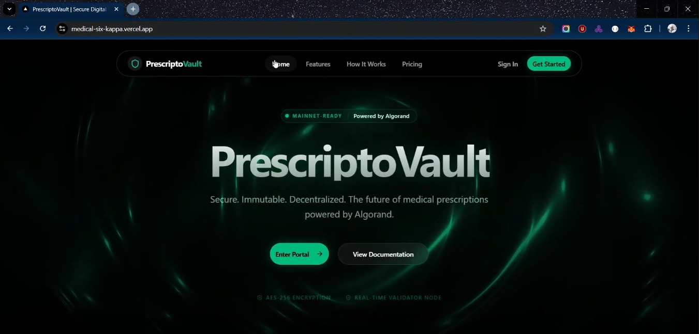

# PrescriptoVault: Decentralized Healthcare Ecosystem 🏥

## 🎥 Project Demo

[](https://drive.google.com/file/d/1DOGz03AKzrarQNmJU6y4ajnpKsZALy_A/view?usp=sharing)

▶️ **[Watch Demo Video on Google Drive](https://drive.google.com/file/d/1DOGz03AKzrarQNmJU6y4ajnpKsZALy_A/view?usp=sharing)**

> **Status**: High-Fidelity Prototype (Database-Ready)
## 🌟 Project Overview
PrescriptoVault is a sophisticated, "Database-Ready" healthcare platform designed to modernize the prescription lifecycle. It connects **Doctors**, **Patients**, **Pharmacies**, and **Administrators** in a unified, secure ecosystem.


### Key Technology Stack
*   **Frontend**: Next.js 14, React 18
*   **Styling**: Tailwind CSS, Shadcn UI
*   **Animations**: Framer Motion
*   **State Management**: Zustand (with Persist Middleware)
*   **Icons**: Lucide React
*   **Mock Backend**: Custom TypeScript "Mock DB" mirroring SQL relationships

---

## 🛠️ Quick Start (Developer Setup)

This project uses **pnpm** for efficient package management. Follow these steps to get running in seconds.

### Prerequisites
*   Node.js 18+ installed
*   pnpm installed (`npm install -g pnpm`)

### Installation & Running
```bash
# 1. Clone the repository
git clone https://github.com/Boredooms/medical.git

# 2. Enter the directory
cd medical

# 3. Install dependencies (frozen-lockfile ensures stability)
pnpm install

# 4. Start the development server
pnpm dev
```
Open [http://localhost:3000](http://localhost:3000) to see the app.

---

## 🤝 How to Modify & Contribute

This project is built with strict TypeScript and simulated backend logic. To make changes without breaking the system:

### 1. Modifying Data Structures
*   **The Source of Truth**: All data types (`User`, `Prescription`) are defined in `src/lib/mockDb.ts`.
*   **Rule**: If you add a field to the UI (e.g., "Patient Phone Number"), you must first add it to the interface in `mockDb.ts` and update the mock data arrays.

### 2. Creating New Components
*   Use the `src/components/ui` folder for generic elements (buttons, cards).
*   Use `src/components/[role]` for specific features (e.g., `src/components/doctor/PrescriptionForm.tsx`).

### 3. Verification
Before pushing changes, ensure no type errors exist:
```bash
# Run type checking
pnpm type-check

# Run linter
pnpm lint
```

---

## 📖 The Vision

**PrescriptoVault** solves the critical issues of prescription fraud, medication tracking, and data interoperability. By treating digital prescriptions as unique, immutable assets (similar to NFTs), we create a trustless ecosystem where:

1.  **Doctors ("Minters")** create unique digital tokens representing prescriptions.
2.  **Patients ("Holders")** hold these tokens in a secure verified vault.
3.  **Pharmacies ("Burners")** verify and "burn" these tokens in exchange for physical medication.
4.  **Admins ("Validators")** oversee the network health and security.

This architecture prevents double-spending (getting meds twice), forgery (fake scripts), and data siloing.

---

## 🏗️ Technical Architecture

### 1. The Frontend ("The Face")
Built on **Next.js 14** using the App Router for robust routing and layouts.
*   **Styling**: A "Medical Emerald" theme using **Tailwind CSS** and **Shadcn UI** for components.
*   **Motion**: **Framer Motion** provides "premium feel" micro-interactions (slide-overs, success checks).

### 2. The Simulation Engine ("The Brain")
We currently simulate a full backend using **Zustand** stores and a centralized "Mock Database".
*   **`src/lib/mockDb.ts`**: Defines the relational schema (`User`, `Prescription`, `Transaction`) and seeds the app with realistic data.
*   **`src/lib/stores/*`**: Handles state management. Example: When a doctor "mints" a prescription, the `doctorStore` updates the local array in `mockDb`, mimicking an API POST request.

### 3. The Ledger ("The Chains")
*   **`src/lib/blockchain.ts`**: A simulation of an Algorand-like ledger. It handles:
    *   **Minting**: Generates unique Asset IDs (`ASA-9921`) and Transaction Hashes.
    *   **Verification**: Checks if a token is valid, expired, or already dispensed (double-spend protection).
    *   **Burning**: Marks a token as `dispensed` and records the pharmacy ID.

---

## 📂 Detailed Repository Structure

```bash
src/
├── app/                                    # 🟢 NEXT.JS APP ROUTER
│   ├── admin/                              # -> Admin Portal (RBAC: Admin)
│   │   ├── analytics/                      #    - Network Stats Visualization
│   │   ├── blockchain/                     #    - Live Ledger Explorer
│   │   ├── security/                       #    - Security Hub & Threat Monitoring
│   │   ├── users/                          #    - User CRUD Management
│   │   └── verification/                   #    - Doctor/Pharmacy KYC Verification
│   │
│   ├── doctor/                             # -> Doctor Portal (RBAC: Doctor)
│   │   ├── appointments/                   #    - Calendar & Scheduling System
│   │   ├── drugs/                          #    - Drug Database & Interaction Checker
│   │   ├── patients/                       #    - Patient Profiles & History
│   │   └── prescriptions/                  #    - Prescription Minting Interface
│   │
│   ├── patient/                            # -> Patient Portal (RBAC: Patient)
│   │   ├── appointments/                   #    - Upcoming Consultations
│   │   ├── qr-codes/                       #    - Dynamic QR Generator for Privacy
│   │   ├── vault/                          #    - Active Prescription Wallet
│   │   └── records/                        #    - Immutable Medical History
│   │
│   └── pharmacy/                           # -> Pharmacy Portal (RBAC: Pharmacist)
│       ├── inventory/                      #    - Smart Inventory with Auto-Reorder
│       ├── orders/                         #    - Supply Chain Tracking
│       └── verify/                         #    - QR Scanner & Token Validator
│
├── components/                             # 🧩 REUSABLE UI COMPONENTS
│   ├── ui/                                 #    - Shadcn Primitives (Button, Card...)
│   ├── layout/                             #    - Sidebar, Headers, Role-Based Layouts
│   ├── doctor/                             #    - Doctor-specific widgets (PatientDialog)
│   ├── pharmacy/                           #    - Pharmacy-specific widgets (ReorderDialog)
│   └── shared/                             #    - Universal widgets (StatsCards, Notifications)
│
├── lib/                                    # ⚙️ CORE LOGIC & STATE
│   ├── blockchain.ts                       #    - Mock Ledger Logic (Mint/Burn/Verify)
│   ├── mockDb.ts                           #    - Central Mock Database & Seeder
│   ├── utils.ts                            #    - CSS & Formatting Helpers
│   └── stores/                             #    - ZUSTAND STATE MANAGERS
│       ├── doctorStore.ts                  #      - Manages doctor's view of patients/Rx
│       ├── patientStore.ts                 #      - Manages patient vault & history
│       └── pharmacyStore.ts                #      - Manages inventory & orders
```

---

## � Core Workflows (User Journeys)

### 🩺 Flow 1: The Doctor (Minting)
1.  **Login**: Enters Doctor Portal.
2.  **Select Patient**: Goes to `Patients` -> Selects Profile.
3.  **Prescribe**: Clicks "New Prescription" -> Adds Drugs (e.g., Amoxicillin).
4.  **Interaction Check**: System checks `mockDb.ts` for conflicts (e.g., Allergen alert).
5.  **Mint**: Doctor signs with "Wallet".
6.  **Result**: A new `Prescription` is created in `mockDb` with `status: 'minted'` and a `txHash`.

### 👤 Flow 2: The Patient (Holding)
1.  **Notification**: Sees new item in "My Vault".
2.  **Visit Pharmacy**: Goes to `QR Codes` page.
3.  **Reveal**: Selects the active prescription -> Generates a secure, time-sensitive QR code containing the `assetId`.

### 🏥 Flow 3: The Pharmacy (Burning)
1.  **Scan**: Pharmacist uses `Verify Prescription` page to scan Patient's QR.
2.  **Verify**: System calls `verifyToken(assetId)`.
    *   *Check 1*: Is it valid? (Yes)
    *   *Check 2*: Is it already dispensed? (No)
3.  **Dispense**: Pharmacist hands over meds -> Clicks "Dispense".
4.  **Burn**: System updates `Prescription` status to `dispensed` and logs a `burn` transaction.

### 🛡️ Flow 4: The Admin (Auditing)
1.  **Monitor**: Sits in "Command Center".
2.  **Alert**: Sees a "Token Burned" event appear in the Audit Log.
3.  **Verify**: Clicks the Transaction Hash to see the block details in the "Blockchain Explorer".

---

## 🚀 Road to Production (The "Next Steps")

This project is structured to be "swapped" onto a real backend with minimal friction.

### Phase 1: Database Migration (Supabase)
*   **Objective**: Replace `mockDb.ts` arrays with PostgreSQL tables.
*   **Action**: Create tables: `users`, `prescriptions`, `transactions`, `inventory`.
*   **Critical**: Keep the same field names (`assetId`, `txHash`) to ensure frontend compatibility.

### Phase 2: API Layer (Next.js API Routes)
*   **Objective**: Create endpoints that the Frontend calls instead of local functions.
*   **Endpoints**:
    *   `POST /api/prescriptions` (Replaces `mintPrescription`)
    *   `POST /api/dispense` (Replaces `burnToken`)
    *   `GET /api/patients/:id`

### Phase 3: Authentication (Clerk/NextAuth)
*   **Objective**: Secure the portals.
*   **Action**: Middleware that checks `user.publicMetadata.role`.
    *   `admin` role -> `/admin` only.
    *   `doctor` role -> `/doctor` only.

---

## 🤖 The "Master Prompt" for Development
**Use this prompt to guide an AI or Developer for the next phase:**

```markdown
# PROJECT: PrescriptoVault Backend Migration

**Current State**:
A polished Next.js 14 frontend exists with a "Mock Backend" (`src/lib/mockDb.ts`) and "Mock Blockchain" (`src/lib/blockchain.ts`).

**Your Mission**:
Convert this Mock System into a Real System using **Supabase** (PostgreSQL + Auth).

**Step-by-Step Instructions**:

1.  **Database**:
    - Mirror the `Prescription` interface in `mockDb.ts` to a SQL table.
    - Ensure `assetId` and `txHash` columns exist (we will generate these on the server).

2.  **Authentication**:
    - Implement a secure Auth solution (Clerk recommended).
    - Create a `middleware.ts` that reads the user's role and protects the `/doctor`, `/patient`, `/pharmacy`, and `/admin` routes accordingly.

3.  **API Integration**:
    - Go to `src/lib/stores/pharmacyStore.ts`.
    - Find the `addInventoryItem` action.
    - REWRITE it to: `await fetch('/api/inventory', { method: 'POST', body: ... })` instead of pushing to a local array.
    - Repeat for `doctorStore` and `patientStore`.

4.  **Real-Time Data**:
    - Connect the "Orders" page in Pharmacy Portal and "Audit Log" in Admin Portal to **Supabase Realtime**.
    - When a new row is added to `transactions`, the UI must update instantly.

**Strict Constraint**:
- DO NOT change the UI components or the file structure. The frontend is approved. Only wire up the data layer.
```
